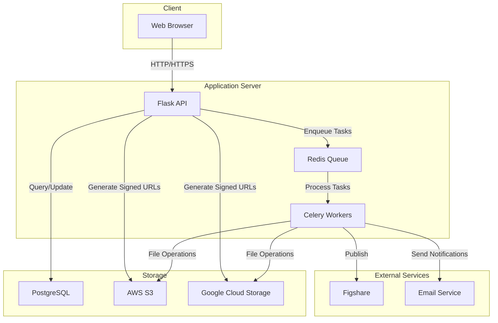
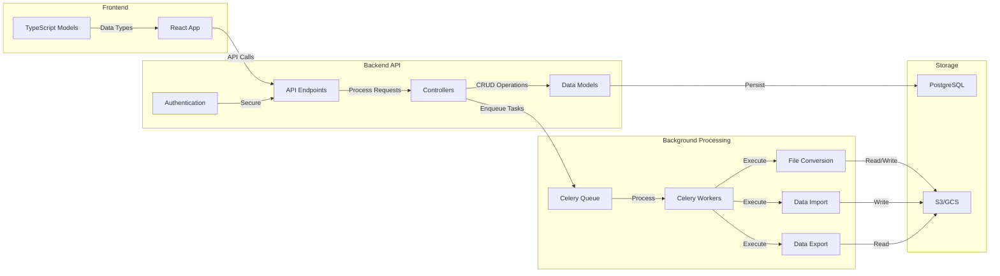

# Taiga 2 Architecture

Taiga 2 is a web application designed to store and retrieve immutable data in a folder-organized way. This document provides an overview of the system architecture.

## System Overview

Taiga is built as a modern web application with a clear separation between frontend and backend components:

1. **Frontend**: React-based single-page application written in TypeScript
2. **Backend**: Python Flask API with Swagger/OpenAPI specification (the swagger document _may_ be wrong. It was manually generated and then the api was implemented referring to that doc as the guidance.)
3. **Storage**: PostgreSQL database for metadata and Amazon S3 Storage for file storage
4. **Background Processing**: Celery with Redis for asynchronous tasks

## Component Architecture

### Database Layer

Taiga uses a hybrid storage approach:

- **PostgreSQL**: Stores all metadata, user information, folder structures, and references to data files
- **S3**: Stores the actual data files (raw files, converted files, etc.)

The database schema is managed through SQLAlchemy ORM with Alembic for migrations. Key models include:

- `User`: User accounts and authentication
- `Entry`: Base class for all content (folders, datasets, etc.)
- `Folder`: Directory-like containers for organizing content
- `Dataset`: Collections of data files with versioning
- `DatasetVersion`: Specific versions of datasets
- `DataFile`: References to actual files stored in S3/GCS

In other words the schema is like:

- Dataset has many
  - DataVersions has many
    - DataFile

Those all have a "ownership model" (meaning, if you delete a dataset, all the versions and files should also be deleted).

Independent of the Dataset model, we have `Folders` which can contain references to other `Folders` and `Datasets`. The relation between a Folder and its contents is modeled by `Entry` records.

### Backend API

The backend is built with Flask and Connexion (for OpenAPI/Swagger integration):

1. **API Endpoints**: Defined in Swagger YAML and implemented in Python
2. **Controllers**: Handle business logic and database operations
3. **Authentication**: Token-based authentication system
4. **File Processing**: Conversion between different file formats (CSV, HDF5, etc.)

Key components:

- `taiga2/controllers/endpoint.py`: API endpoint implementations
- `taiga2/controllers/models_controller.py`: Database operations
- `taiga2/conv/`: File conversion utilities
- `taiga2/third_party_clients/`: Integrations with S3, GCS, Figshare, etc.

### Frontend Application

The frontend is a React application written in TypeScript:

1. **Models**: TypeScript interfaces matching backend data structures
2. **API Client**: Typed API client for backend communication
3. **UI Components**: React components for user interface
4. **State Management**: React state management for application state

### Background Processing

Taiga uses Celery with Redis for handling long-running tasks:

1. **File Conversion**: Converting between file formats
2. **Data Import/Export**: Handling large file uploads/downloads
3. **Integration Tasks**: Communication with third-party services

## Data Flow

1. **User Authentication**: Users authenticate via token-based auth
2. **Data Organization**: Users create folders and datasets to organize their data
3. **Data Upload**: Files are uploaded to S3/GCS via presigned URLs
4. **Processing**: Background tasks process and convert files as needed
5. **Versioning**: Dataset versions are created to track changes
6. **Access Control**: Permissions control who can view/edit content

## Integration Points

Taiga integrates with several external services:

1. **AWS S3**: Primary file storage
2. **Google Cloud Storage**: Alternative file storage (but in practice, not used)
3. **Figshare**: Publishing datasets to Figshare (Doesn't work. We've externalized this into a script. All figshare UI code would be best off deleted.)
4. **Email Notifications**: Subscription-based notifications for dataset changes (I think this must have stopped working)

## Deployment Architecture

Taiga is deployed as a containerized application:

1. **Docker**: Application packaged as Docker containers
2. **CI/CD**: Travis CI for testing and building images (this hasn't happened in years)
3. **GCP**: Container images stored in Google Container Registry (Note: GCR was shutdown last year, so _if_ this still works, it's actually an alias for Google Artificate Registry)
4. **Systemd**: Service management on deployment servers

## Security Model

1. **Authentication**: Token-based authentication
2. **Authorization**: Group-based access control (This is not really fully implemented. If there is code about group-based access, I am willing to bet it is half-implement if at all)
3. **Secure Storage**: Taiga will sign URLs for fetching data from S3 and give them to the client, so that the transfer of large data happens directly between client and S3.

## Deployment Diagram

## Service Architecture

